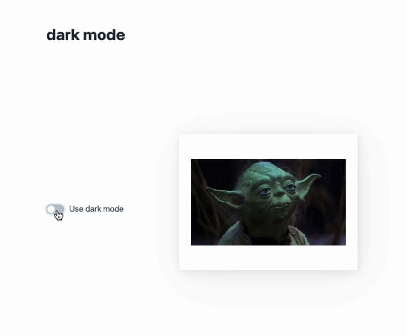

# Dark Mode Toggle for Web

Simple web implementation of a Dark/Light mode toggle feature using HTML, CSS, and JavaScript.

## Features

- **Dark/Light Mode Toggle**: Easily switch between dark and light themes with a checkbox.

## Installation

Just clone the repository and open `index.html` in your browser.

## Demonstration

